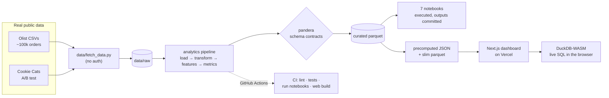

# Marketplace Analytics — Olist Brazilian E‑Commerce

**An end‑to‑end analytics project on ~100k real orders: a validated Python pipeline feeding seven analysis notebooks and a live, backend‑free dashboard that runs SQL in your browser.**

[](https://github.com/shiva-shivanibokka/Data-Analytics-Portfolio/actions/workflows/ci.yml)
[](https://data-analytics-portfolio-seven-lac.vercel.app)
[](LICENSE)


> ### 🔎 Recruiter TL;DR
> - **What it is:** a full analytics stack on the **real [Olist](https://www.kaggle.com/datasets/olistbr/brazilian-ecommerce) Brazilian e‑commerce dataset** — a reproducible pandas/DuckDB pipeline with schema validation, seven interview‑grade notebooks (EDA, cohort/retention, funnel, A/B testing, metric design, root‑cause, statistical inference), and an interactive dashboard deployed on Vercel.
> - **Hardest problem solved:** shipping an *interactive* data product with **no backend and no database** — the browser fetches a Parquet file and runs live SQL against ~99k rows via **DuckDB‑WASM**, with the charts precomputed by a Python pipeline so the site and the analysis can never disagree on a number.
> - **No synthetic data:** every figure is computed from real public datasets; nothing is planted or fabricated.

**▶️ Live dashboard: https://data-analytics-portfolio-seven-lac.vercel.app**

---

## Overview

This project answers the questions a data analyst at an online marketplace faces every week — *Are we keeping customers? Where are orders lost? Did our experiment work? Why did this metric drop?* — using a **real** dataset rather than a synthetic one, and packaging the results as both rigorous notebooks and a product a non‑technical stakeholder can click through.

It is built as a job‑application portfolio piece, so it deliberately covers the full arc: **data engineering → analysis → statistics → a deployed, tested, CI‑backed product.**

- **Anchor dataset — [Olist](https://www.kaggle.com/datasets/olistbr/brazilian-ecommerce):** ~100k real orders placed on a Brazilian marketplace between Sep 2016 and Aug 2018 (orders, items, payments, reviews, customers, sellers, geolocation).
- **Experiment dataset — Cookie Cats:** a real mobile‑game A/B test (~90k players), used for the experimentation notebook because Olist contains no controlled experiment.

Both are fetched from public mirrors by `data/fetch_data.py` — **no Kaggle account or API token required.**

## Key findings

All figures below are computed from the real data by the pipeline/notebooks and are reproducible from a clean clone.

| Finding | Detail |
|---|---|
| **Olist is a one‑purchase marketplace** | Only **~3.1%** of customers ever order again — retention, not acquisition, is the structural constraint. |
| **The fulfilment leak is lateness, not cancellation** | **97%** of orders reach *delivered*; ~1.2% are cancelled/unavailable. But **8.1%** of delivered orders arrive **late**, concentrated in distant states (Maranhão ~20% vs ~5% in the São Paulo core). |
| **A 2018 delivery backlog dragged down reviews** | On‑time delivery collapsed to **78.6%** in Mar‑2018 and average review fell to **3.75**. Across months, `corr(on‑time rate, avg review) = +0.94`. |
| **Late delivery is the dominant review driver** | Late orders average **2.57★** vs **4.29★** on time (Cohen's *d* ≈ **1.45**, a very large effect). By Bayes' theorem, a 1‑star review makes lateness **~4.7×** more likely than the base rate. |
| **A/B test: don't move the level gate** | Moving Cookie Cats' gate from level 30 → 40 **lowers** 7‑day retention (**19.0% → 18.2%**, two‑proportion z‑test **p = 0.002**). Recommendation: keep `gate_30`. |

## Architecture

The design goal was an *interactive* analytics site that needs **no server and no database** — so it survives as a zero‑cost, always‑on portfolio piece. All heavy computation happens offline in Python; the browser only reads small static artifacts (and queries one Parquet file directly with DuckDB‑WASM).



**Why it's shaped this way**

- **Precompute in Python, render static on the web.** The dashboard's charts read JSON emitted by the *same* metric functions the notebooks use, so the site and the analysis can never disagree. The alternative — a live API querying a database — would add a backend, a bill, and a second source of truth for no analytical gain.
- **DuckDB‑WASM instead of a query backend.** For the one genuinely interactive surface (the Explorer), the browser fetches `orders.parquet` and runs real SQL client‑side. This keeps "no backend" true while still letting a visitor slice ~99k rows themselves.
- **Schema contracts at the pipeline boundary.** `pandera` validates the curated tables in the build and in CI, so an upstream data change fails loudly at the boundary instead of silently corrupting a chart three notebooks later.

## Tech stack

| Layer | Tools | Notes |
|---|---|---|
| Pipeline | **pandas**, **DuckDB**, **pandera**, **pyarrow** | ETL + schema validation; Parquet as the interchange format |
| Analysis | **NumPy**, **SciPy**, **statsmodels**, **matplotlib**, **seaborn** | hypothesis tests, bootstrap, power analysis, visualization |
| Web | **Next.js 14**, **React 18**, **TypeScript**, **Recharts**, **@duckdb/duckdb-wasm** | static dashboard + in‑browser SQL; pure‑CSS design system (no UI framework) |
| Tooling | **ruff**, **pytest** + **nbmake**, **GitHub Actions**, **Vercel** | lint, tests, notebook execution, git‑connected deploys |

Dependency versions are pinned to tested majors in `pyproject.toml` (`pandas<3`, `numpy<2`, `scipy<1.18`, …) so CI and a fresh clone reproduce the exact stack the notebooks were executed against.

## Skills demonstrated

- **Data engineering / ETL pipeline design** — layered `load → transform → validate → metrics` pipeline with Parquet interchange and `pandera` schema contracts.
- **Statistical inference & experimentation** — two‑proportion z‑tests, Welch's t‑test, Mann‑Whitney U, Wilson CIs, bootstrap, power/MDE, Bayes' theorem, Simpson's paradox, regression to the mean.
- **Product analytics** — cohort/retention triangles, funnel analysis, metric‑tree definition (primary/guardrail/counter/leading/ecosystem), root‑cause investigation.
- **SQL** — DuckDB in the pipeline and live in the browser (DuckDB‑WASM).
- **Full‑stack / data‑app development** — Next.js + React + TypeScript, client‑side WASM, data‑viz (Recharts).
- **CI/CD pipeline implementation** — GitHub Actions running lint, tests, end‑to‑end notebook execution, and a web build.
- **Cloud deployment** — Vercel, git‑connected (every push to `main` auto‑deploys).
- **Automated testing** — `pytest` unit + integration tests; `nbmake` executes all notebooks in CI.
- **System design & architecture** — documented tradeoffs (serverless, no‑DB, precompute‑then‑render); reproducible, pinned dependencies.

## Getting started

**Prerequisites:** Python 3.11+ and (for the dashboard) Node 20+.

```bash
# 1. Install the analytics package + dev tools
pip install -e ".[dev]"

# 2. Download the real datasets (Olist + Cookie Cats) — no account needed
python data/fetch_data.py

# 3. Run the pipeline: raw CSV → validated curated Parquet + dashboard JSON
python -m analytics.build

# 4. Open a notebook
jupyter notebook notebooks/01_eda_and_business_framing.ipynb
```

Run the dashboard locally:

```bash
cd web
npm install
npm run dev        # http://localhost:3000
```

A `Makefile` wraps the common tasks: `make setup`, `make data`, `make build`, `make test`, `make lint`, `make notebooks`, `make web`.

## Usage

The notebooks and the dashboard both consume the pipeline's curated tables, so a metric is defined once and used everywhere:

```python
import pandas as pd
from analytics import config, metrics

orders = pd.read_parquet(config.ORDERS)
customers = pd.read_parquet(config.CUSTOMERS)

metrics.kpi_summary(orders, customers)
# {'orders': 99421, 'customers': 96090, 'gmv': 16003842.91, 'aov': 160.97,
#  'repeat_rate': 0.0312, 'avg_review': 4.087, 'on_time_rate': 0.9189, ...}
```

### The seven notebooks

| # | Notebook | Question it answers |
|---|---|---|
| 01 | EDA & Business Framing | What does the marketplace look like right now? |
| 02 | Cohort & Retention | Are we keeping customers? (spoiler: ~3% repeat) |
| 03 | Funnel Analysis | Where are orders lost? |
| 04 | A/B Testing | Should we ship the change? (Cookie Cats gate 30 vs 40) |
| 05 | Metric Definition & Product Sense | How would you measure a new feature's success? |
| 06 | Metric‑Drop Investigation | Reviews fell ~10% in early 2018 — why? |
| 07 | Statistical Inference | What can we conclude with confidence — and where does intuition mislead? |

## Project structure

```
├── data/fetch_data.py        # download real Olist + Cookie Cats data (no auth)
├── src/analytics/            # the pipeline package
│   ├── load.py               #   read raw CSVs → typed DataFrames
│   ├── transform.py          #   clean + enrich → curated orders/items/customers
│   ├── validate.py           #   pandera schema contracts
│   ├── metrics.py            #   reusable business metrics + web JSON export
│   └── build.py              #   orchestrator: raw → validated parquet → web artifacts
├── notebooks/                # 01–07, executed with outputs committed
├── tests/                    # pytest unit + integration tests
├── web/                      # Next.js dashboard (Recharts + DuckDB-WASM)
│   └── public/data/          # committed JSON + slim parquet the dashboard reads
├── .github/workflows/ci.yml  # lint · tests · run notebooks · web build
├── AUDIT.md                  # whole-repo bug-audit report
└── Makefile · pyproject.toml
```

## Testing

```bash
pytest -q                       # unit + integration tests on the pipeline
ruff check src tests data       # lint
pytest --nbmake notebooks/ -q   # execute every notebook end-to-end
```

CI runs all of the above on every push, **plus** a build of the web dashboard, so a broken notebook or a broken chart fails the pipeline. Notebook execution in CI is the coverage that matters most here: it proves all seven analyses run top‑to‑bottom against freshly fetched data.

## Deployment

The dashboard is deployed on **Vercel**, imported directly from this GitHub repo with the root directory set to `web/`. The project is **git‑connected**: every push to `main` triggers an automatic production build and deploy. No environment variables or secrets are required — the app is fully static plus in‑browser DuckDB‑WASM.

**Live:** https://data-analytics-portfolio-seven-lac.vercel.app

## Roadmap / known limitations

- **Olist has no clickstream**, so the funnel is modeled on the order‑status lifecycle rather than page‑level events; the A/B analysis therefore uses a separate real experiment dataset (Cookie Cats).
- **Repeat‑purchase signal is thin** (~3% by design of the marketplace), which limits deep cohort‑LTV modeling — surfaced honestly rather than papered over.
- **No frontend unit tests** — the Python pipeline carries the automated test suite; the dashboard is validated via the CI build and manual review.
- **Possible next steps:** a lightweight repeat‑purchase / review‑score prediction model, and seller‑side cohort analysis.

## License

[MIT](LICENSE) © Shivani Bokka

## Author

**Shivani Bokka** — built as a portfolio piece demonstrating end‑to‑end analytics engineering on real data.
